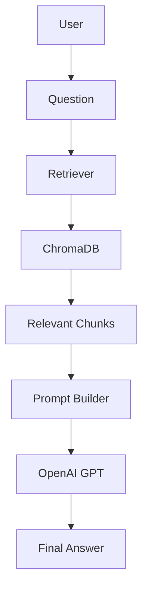
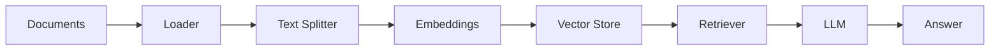

# 🚀 Modular Retrieval-Augmented Generation (RAG) System

> A production-ready, modular Retrieval-Augmented Generation (RAG) pipeline built with **Python**, **LangChain**, **ChromaDB**, and **OpenAI** for accurate document-based question answering.


---

# 📖 Overview

Large Language Models (LLMs) are powerful, but they are limited by their pre-trained knowledge and cannot reliably answer questions about private or custom documents.

This project implements a **Retrieval-Augmented Generation (RAG)** pipeline that retrieves relevant information from user-provided documents before sending context to the language model, resulting in more accurate and context-aware responses.

The project follows a modular architecture, making it easy to maintain, extend, and integrate into larger AI applications.

---

# ✨ Features

- 📄 Load PDF, TXT and Markdown documents
- ✂️ Recursive text chunking
- 🧠 OpenAI Embeddings
- 🔍 Semantic similarity search
- 🗄️ Chroma Vector Database
- 🤖 OpenAI GPT Integration
- ⚡ Fast document retrieval
- 🧩 Clean modular architecture
- 🔐 Environment variable configuration
- 📦 Easily extensible for production use

---

# 🏛️ System Design



---

# 🏗️ RAG Pipeline



---

# 📂 Project Structure

```
rag-project/
│
├── data/
│
├── src/
│   ├── loader.py
│   ├── splitter.py
│   ├── embedding.py
│   ├── vectorstore.py
│   ├── retriever.py
│   └── llm.py
│
├── chroma_db/
├── main.py
├── requirements.txt
├── .env
└── README.md
```

---

# ⚙️ Tech Stack

| Layer | Technology |
|--------|------------|
| Language | Python |
| Framework | LangChain |
| Vector Database | ChromaDB |
| Embedding Model | OpenAI Embeddings |
| LLM | OpenAI GPT |
| Environment | python-dotenv |

---

# ⚡ Workflow

1. Load documents
2. Split documents into chunks
3. Generate embeddings
4. Store vectors in ChromaDB
5. Retrieve the most relevant chunks
6. Build the prompt
7. Generate the final answer using OpenAI GPT

---

# 🚀 Installation

```bash
git clone https://github.com/yourusername/rag-project.git

cd rag-project

pip install -r requirements.txt
```

---

# 🔑 Environment Variables

Create a `.env` file:

```env
OPENAI_API_KEY=your_api_key
```

---

# ▶️ Run

```bash
python main.py
```

---

# 💬 Example

### Question

```
What is Retrieval-Augmented Generation?
```

### Retrieved Context

```
Retrieval-Augmented Generation combines document retrieval with language models to improve factual accuracy.
```

### Answer

```
Retrieval-Augmented Generation (RAG) enhances LLMs by retrieving relevant information from external knowledge sources before generating a response.
```

---

# 📊 Data Flow

```
Documents
     │
     ▼
Loader
     │
     ▼
Text Splitter
     │
     ▼
Embeddings
     │
     ▼
ChromaDB
     │
     ▼
Retriever
     │
     ▼
Prompt Builder
     │
     ▼
OpenAI GPT
     │
     ▼
Answer
```

---

# 🎯 Design Decisions

### Why LangChain?

Provides a modular framework for building Retrieval-Augmented Generation pipelines.

### Why ChromaDB?

A lightweight and persistent vector database optimized for semantic search.

### Why Embeddings?

Embeddings convert text into numerical vectors, enabling efficient similarity search.

### Why Chunking?

Smaller document chunks improve retrieval accuracy and reduce prompt size.

---

# 🚀 Future Improvements

- [ ] Streamlit UI
- [ ] FastAPI Backend
- [ ] Docker Support
- [ ] Hybrid Search
- [ ] Re-ranking
- [ ] Multi-Document Support
- [ ] Conversation Memory
- [ ] Authentication
- [ ] REST API
- [ ] Evaluation Metrics

---

# 📸 Screenshots

> Screenshots and demo GIF will be added soon.

---

# 📈 Project Status

🟢 Active Development

---

# 📄 License

This project is licensed under the MIT License.

---

# 👨‍💻 Author

**Your Name**

GitHub: https://github.com/yourusername

LinkedIn: https://linkedin.com/in/yourusername
